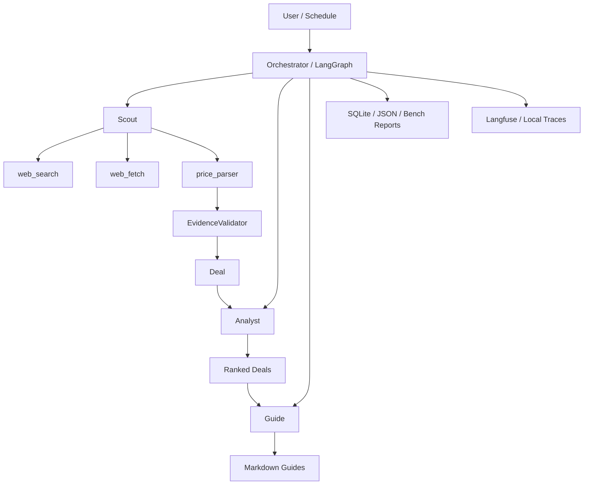

# BudgetWings — Case Study

> A low-cost travel deal AI agent, with 3 layers of engineering defense
> against LLM unreliability.

BudgetWings started as a cheap-travel intelligence project and gradually turned
into an engineering case study about how to make LLM output trustworthy enough
for a real product surface.

Across T2, T3, and T4-B, the project shipped three explicit defenses:
structured output, evidence-driven validation, and an agentic Scout loop that
was benchmarked against the old deterministic pipeline instead of replacing it
on hype alone.

---

## The problem

Low-cost travel information is noisy in two different ways.

First, the raw market is messy. Deals live across airline promo pages,
aggregator snippets, and travel communities. A traditional crawler approach can
work, but it is brittle: every new source needs bespoke maintenance, and every
HTML or API change turns into engineering overhead.

Second, LLM-based extraction introduces a new trust problem. A model can return
beautifully formatted JSON while still inventing a cheaper price, a nicer URL,
or even the wrong destination. That means "LLM agent" is not a product story by
itself. The real work starts after the first working demo.

BudgetWings treats this as a systems problem:

- use LLMs where they are strong
- isolate them behind explicit schemas
- ground extracted facts in source evidence
- keep a deterministic fallback path
- benchmark every meaningful change

The result is a project that is as much about reliability architecture as it is
about travel deals.

There is also a practical reason this framing matters. A lot of portfolio
projects show only a happy-path demo. BudgetWings is stronger when read as a
record of engineering decisions under uncertainty:

- where the LLM boundary should begin and end
- what should be validated by schema vs validated by code
- when a deterministic system is better than an agentic one
- how to prove improvement without depending on lucky demo runs

## Architecture at a glance

The interesting boundary is inside Scout:

- legacy mode = deterministic query pipeline + structured extraction
- agentic mode = tool-using loop + explicit `submit_deal` tool
- both modes still end in the same downstream `Deal` contract
- both modes still rely on T3 evidence validation before a deal is kept

This gives the system two different kinds of contracts:

1. **shape contracts** between the model and the parser layer
2. **truth contracts** between extracted facts and the source text

That separation is what made the later refactors legible. Once those contracts
were explicit, each improvement could target one failure boundary at a time
instead of trying to make the model "generally smarter."

## Three layers of defense

### Layer 1: Structured Output (T2)

**Problem:** LLMs return JSON in fenced blocks sometimes, in plain text other
times, with explanatory preamble occasionally. Regex-based extraction broke in
all three cases.

**Fix:** Replaced regex parsing with native tool-use / structured output at the
SDK layer. The LLM is forced to emit schema-compliant JSON; `json.loads` is
never called on free text.

**Result:**

| Metric | Before | After | Delta |
|---|---:|---:|---:|
| Parse success rate | 46.7% | 100.0% | +53.3 pp |
| Pydantic validation failures | 0 | 0 | 0 |
| Empty results (as product decision) | 0 | 6 | +6 |

The "0 -> 0" line for Pydantic validation is deceptive at first glance. It does
not mean nothing improved. It means the original failures happened *before*
Pydantic ever saw the payload: the regex + `json.loads` layer broke first.
T2 did not improve downstream acceptance rates; it removed an entire fragile
stage in front of them.

That was the first important principle to emerge: if you let free-form text sit
between the model and your schema, your reliability story is already weaker than
it looks.

Another useful side effect was observability. Once extraction was routed through
an explicit schema, failures stopped looking like generic parser crashes and
became measurable events: empty result, structured extraction failure, or
downstream rejection. That made regressions much easier to reason about.

See [`data/bench/T2_before_after.md`](data/bench/T2_before_after.md) for the
full benchmark.

### Layer 2: Evidence-Driven Validation (T3)

**Problem:** Structured output guarantees format but not truth. An LLM can
still invent a fake price or a wrong destination, return it in perfectly-shaped
JSON, and pass all schema checks.

**Fix:** Every extracted deal must carry an `evidence_text` field, which must be
a contiguous normalized substring of the source text and must contain both the
price number and the destination name.

**Result (with deliberate hallucination injection):**

| Metric | Structured only (T2) | Structured + Validation (T3) | Delta |
|---|---:|---:|---:|
| Hallucinations injected | 5 | 5 | - |
| Hallucinations rejected | 0 | 4 | +4 |
| Rejection rate | 0.0% | 80.0% | +80 pp |
| False-positive rejections | 0 | 0 | 0 |

The validator is intentionally split into three independent checks:

1. evidence must really exist in the source text
2. the submitted price must appear inside that evidence
3. the destination must also appear inside that evidence

This is stricter than fuzzy semantic matching, and that strictness is on
purpose. A contiguous substring requirement makes the contract legible:
grounding is not "the model summarized something close enough"; grounding is "we
can point to the exact text span that supports this fact."

That choice trades some recall for a much cleaner failure boundary. For this
project, that is the right trade.

In practice, this layer turns `evidence_text` from a nice-to-have hint into a
real contract. A deal is no longer accepted because the model sounded
confident; it is accepted because the system can point to the exact text span
that supports the price and destination pair.

See [`data/bench/T3_before_after.md`](data/bench/T3_before_after.md) for the
full benchmark.

### Layer 3: Agentic Loop (T4-B)

**Problem:** The previous Scout was a hardcoded pipeline with 13 whitelisted
destinations and fixed search query templates. It could not adapt its search
path, decide when to stop early, or surface unexpected destinations efficiently.

**Fix:** Added an agentic mode that uses OpenAI function calling. The LLM
autonomously plans queries, chooses whether to search or fetch, decides when to
stop, and submits deals through a strict `submit_deal` tool. Legacy mode is
retained as the cheap default for scheduled jobs.

**Result:**

| Metric | Legacy | Agentic | Delta |
|---|---:|---:|---:|
| Tool calls per run | 18 | 8 | -10 (-55%) |
| Unique destinations found | 2 | 3 | +1 |
| Destinations outside legacy whitelist | 0 | 1 | +1 |
| Accepted deals | 2 | 3 | +1 |

The most interesting finding here is counter-intuitive: agentic Scout used
*fewer* tool calls than the legacy pipeline in the mock benchmark.

Why- Legacy mode pays a deterministic cost up front. It keeps marching through
its fixed search space even after it already has enough decent answers. Agentic
mode changes the cost model: it becomes less call-bound and more token-bound.
The model can stop after it has found enough grounded deals instead of scanning
the rest of a hardcoded shortlist.

This is why legacy was kept instead of deleted. The right question is not
"which one is newer-" The right question is "which one is better for this
workload-"

That decision also made the benchmark more honest. If agentic Scout had been
the only surviving path, there would be no stable baseline left to compare
against. Keeping both modes alive is part of the evaluation strategy, not just
backwards compatibility.

See [`data/bench/T4B_legacy_vs_agentic.md`](data/bench/T4B_legacy_vs_agentic.md)
for the full benchmark.

---

## Benchmark methodology

The three benchmark suites in this repository do not all ask the same question.
That matters for interpreting the numbers correctly.

- **T2** isolates parser robustness under noisy output formatting.
- **T3** injects deliberate hallucination patterns to stress grounding logic.
- **T4-B** compares control-flow strategies between a deterministic pipeline and
  an agentic tool loop.

Most of these numbers come from deterministic mock mode by design. That keeps
the reports reproducible and makes deltas trustworthy inside CI or code review.
The trade-off is that mock mode says more about correctness and control flow
than it does about production cost variance.

This is why the repository keeps both benchmark artifacts and probe artifacts:

- `data/bench/` answers "did the design improve-"
- `data/probe/` answers "what does the current provider stack actually support-"

## Design principles that emerged

- **Format correctness is the LLM's job. Truth correctness is your job.**
  Schema enforcement alone does not protect against hallucination.

- **Keep legacy alongside the new hotness.**
  Agentic is powerful, but not every workload needs open-ended planning.
  Coexistence creates a measurable decision boundary instead of a marketing one.

- **Evidence must be a substring, not a summary.**
  The moment paraphrase becomes acceptable, grounding becomes subjective.

- **Benchmark first, argue second.**
  Every major change in this project shipped with a before/after report. Claims
  in the repo should be traceable to numbers, not vibes.

- **Treat the LLM boundary as an anti-corruption layer problem.**
  `ExtractedDeal` exists because an LLM-facing schema should not be identical to
  the domain model consumed by the rest of the system.

- **Reliability layers should fail independently.**
  T2 and T3 solve different problems. If one breaks, the other still carries
  signal. That independence matters more than elegance.

- **A good benchmark is also a communication artifact.**
  The reports in `data/bench/` are written so future maintainers, reviewers, and
  interviewers can all answer the same question: what changed, why, and how do
  we know it got better-

## What's not done

- Destination aliases are still hardcoded to a small Python mapping. That limits
  both evaluation realism and long-tail expansion. A data-driven destination
  layer is still future work.

- Guide generation is not yet agentic in the same way Scout is. It benefits
  from RAG and templates, but not from a full planning loop.

- There is no systematic multi-model comparison yet. `gpt-5.4` vs
  `gpt-5.4-mini` vs Claude would be a natural next benchmark suite, but it has
  not been done.

- Most benchmark numbers are from reproducible mock runs. That is deliberate
  and good for CI, but it also means real API cost/latency variance has not
  been fully characterized.

- Provider probing was done against the IkunCode proxy path that was actually
  available during development. The same matrix was not rerun against official
  OpenAI or Anthropic endpoints.

- Agentic Scout can currently surface destinations outside the legacy shortlist,
  but that behavior still depends on today's alias fallback logic and should not
  be over-claimed as "unbounded exploration."

- The public website and bot surfaces exist, but they are still supporting
  layers around the core engineering story. The distinctive value of this repo
  is still the reliability architecture.

## Stack

- Python 3.11, asyncio, Pydantic 2
- LangGraph (pipeline state machine), LanceDB (RAG with JSON fallback)
- OpenAI-compatible function calling (via IkunCode proxy -> gpt-5.4)
- SQLite (local persistence), Next.js 14 static export (public dashboard)
- Telegram bot (read-only), MCP server (for Claude Desktop integration)
- Langfuse (LLM tracing), Tavily (web search)

## Timeline

- T1: Cleanup & doc alignment (1 commit)
- T2: Structured output refactor (2 commits)
- T3: Evidence validation (2 commits)
- T4 probe: Capability matrix for LLM providers (1 commit)
- T4-B: Agentic Scout + bench fairness patch (3 commits)
- T5: Project packaging (this)

The actual work rhythm matters almost as much as the features: each meaningful
change was split into implementation and evidence, so the repository history can
be read as a sequence of hypotheses and measurements rather than a pile of
unrelated commits.

That is also how the project is meant to be presented. The strongest reading of
BudgetWings is not "I built a travel site." It is "I designed, measured, and
iterated on a small LLM system with explicit defenses against the ways these
systems fail."

---

## Independent evaluation

After T2-T4-B shipped, a separate Codex agent was given read-only access to
the repository and real API credentials, with instructions to run the full
pipeline and report what actually works.

### V1 evaluation (pre-T6)

Score: **3/5**

The evaluator found one Critical issue: `OpenAIAdapter.extract_structured()`
relied on OpenAI's `response_format` parameter, which the IkunCode proxy did
not support. Every live `price_parser` call failed (0/5), and legacy Scout
spent 186 seconds to produce 0 deals.

Agentic mode partially worked because it used `chat_with_tools` instead of
`extract_structured`, but persistence was inconsistent: the run log reported
2 saved deals while the output file was empty.

### T6 hotfix

Three fixes shipped in response:

1. `extract_structured` gained a tool-use fallback: try `response_format`
   first, fall back to forced `tool_choice` if the proxy rejects it
2. Deal snapshots now include mode and timestamp in the filename, preventing
   same-day overwrites
3. `evidence_text` is preserved in `Deal.notes` for post-hoc auditability

### V2 evaluation (post-T6)

Score: **4/5**

| Metric | V1 | V2 |
|---|---|---|
| price_parser live success | 0/5 | 5/5 |
| Legacy Scout deals | 0 | 5 |
| Agentic Scout deals | 2 (inconsistent) | 3 (consistent) |
| Deal file overwrite | yes | no |

The Critical issue was resolved. The evaluator noted that extraction yield on
some samples was still low (3 of 5 returned zero deals), attributed to strict
evidence validation and degraded sample input quality rather than a provider
failure.

### What this process proved

The evaluation loop - build, ship, independent test, fix, retest - is more
valuable than any single feature. It surfaced a provider-compatibility gap that
unit tests and mock benchmarks could not catch, and it forced a fix that made
the system genuinely more robust.

The 3/5 -> 4/5 arc is also a better portfolio story than a clean 5/5 would
have been. It shows that the project can absorb real feedback and improve,
which is harder to demonstrate than getting everything right on the first try.

Full commit log: `git log --oneline`

Full evaluation reports: [`data/eval/EVAL_REPORT.md`](data/eval/EVAL_REPORT.md) and [`data/eval/EVAL_REPORT_V2.md`](data/eval/EVAL_REPORT_V2.md)
